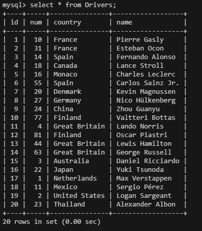
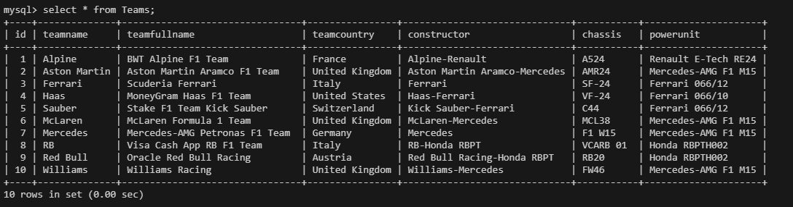
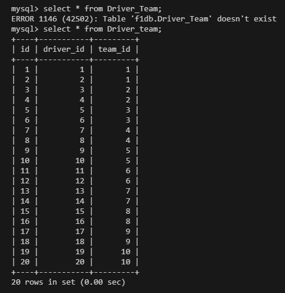
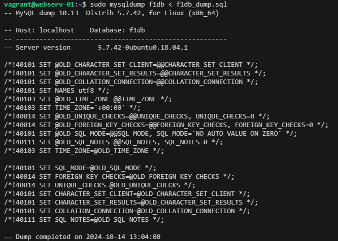
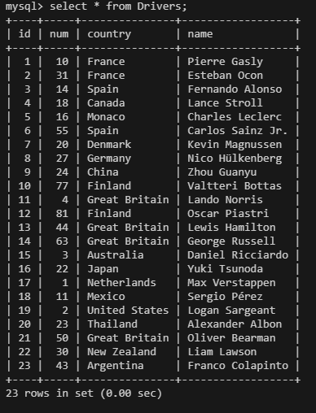

# Homework for lesson13
# Створення бази даних гонщиків Formula 1 2024

## 1) Скрипт створення бази f1db - F1_database.sql

## 2) Створено таблицю Drivers з полями:
### - id (первинний ключ, автоінкремент)
### - num (номер гонщика)
### - country (країна народження)
### - name (Ім'я та прізвище)

## 3) Створено таблицю Teams з полями:
### - id (первинний ключ, автоінкремент)
### - teamname (ім'я команди)
### - teamfullname (повне ім'я команди)
### - teamcountry (країна команди)
### - конструктор (конструктор)
### - chassis (шасі)
### - powerunit (двигун)

## 4) Створено таблицю Driver_team з полями:
### - id (первинний ключ, автоінкремент)
### - team_id (id гонщика)
### - driver_id (id команди)

## 6) Додано 3 записи до таблиць
INSERT INTO Drivers(`num`, `country`, `name`) VALUES(
'50','Great Britain','Oliver Bearman');

INSERT INTO Drivers(`num`, `country`, `name`) VALUES(
'30','New Zealand','Liam Lawson');

INSERT INTO Drivers(`num`, `country`, `name`) VALUES(
'43','Argentina','Franco Colapinto');

INSERT INTO Driver_team(`driver_id`, `team_id`) VALUES(21, 3);

INSERT INTO Driver_team(`driver_id`, `team_id`) VALUES(22, 8);

INSERT INTO Driver_team(`driver_id`, `team_id`) VALUES(23, 10);

## 7) Запити

список всіх гонщиків разом з командами, в який вони працюють, та місце растошування команды

кількість гонщиків на кожному двигуні

список гонщиків з краіни Great Britain

## 8) Створено  бекап бази f1db
sudo mysqldump f1db > f1db_dump.sql

### удалил базу

drop database f1db;

### востановнено базу f1db

### Перевірено повноту востановлення

