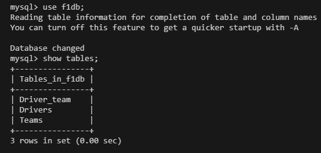

# Homework for lesson13
# Создание базы данных гонщиков Formula 1 2024 года

## 1) Скрипт создания базы f1db - F1_database.sql

## 2) Создана таблица Drivers с полями:
###    - id (первинний ключ, автоінкремент)
###    - num (номер гонщика)
###    - country (страна рождения )
###    - name (Имя и фамилия)

## 3) Создана таблица Teams с полями:
###    - id (первинний ключ, автоінкремент)
###    - teamname (имя команды)
###    - teamfullname (полное имя команды)
###    - teamcountry (краiна команди)
###    - constructor (конструктор)
###    - chassis (шаси)
###    - powerunit (двигун)

## 4) Создана таблица Driver_team с полями:
###    - id (первинний ключ, автоінкремент)
###    - team_id (id гонщика)
###    - driver_id (id команды)

mysql> SELECT Drivers.*, Teams.* FROM Drivers INNER JOIN (Driver_team INNER JOIN Teams ON Driver_team.team_id = Teams.id) ON Drivers.id = Driver_team.driver_id where `country` like 'Great Britain';
+----+-----+---------------+----------------+----+----------+--------------------------------+----------------+-------------------+---------+---------------------+
| id | num | country       | name           | id | teamname | teamfullname                   | teamcountry    | constructor       | chassis | powerunit           |
+----+-----+---------------+----------------+----+----------+--------------------------------+----------------+-------------------+---------+---------------------+
| 11 |   4 | Great Britain | Lando Norris   |  6 | McLaren  | McLaren Formula 1 Team         | United Kingdom | McLaren-Mercedes  | MCL38   | Mercedes-AMG F1 M15 |
| 13 |  44 | Great Britain | Lewis Hamilton |  7 | Mercedes | Mercedes-AMG Petronas F1 Team  | Germany        | Mercedes          | F1 W15  | Mercedes-AMG F1 M15 |
| 14 |  63 | Great Britain | George Russell |  7 | Mercedes | Mercedes-AMG Petronas F1 Team  | Germany        | Mercedes          | F1 W15  | Mercedes-AMG F1 M15 |
| 21 |  50 | Great Britain | Oliver Bearman |  3 | Ferrari  | Scuderia Ferrari               | Italy          | Ferrari           | SF-24   | Ferrari 066/12      |
+----+-----+---------------+----------------+----+----------+--------------------------------+----------------+-------------------+---------+---------------------+
4 rows in set (0.00 sec)
